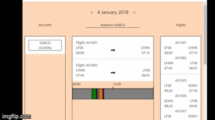

# aircraft-scheduling-react

Client application in where the user edits the flights listed.


## to get the repo:

```
git clone https://github.com/jolaya182/aircraft-scheduling-react.git

```
To run, go to the folder: aircraft-scheduling-react

To install:
```
npm  i
```

To run, go to the src folder:

```
npm run build
```

open the dist folder and click on the `index.html` file

to work in development mode type:

```
npm start
```
then go to `http://localhost:8080/` url on your webbrowser
